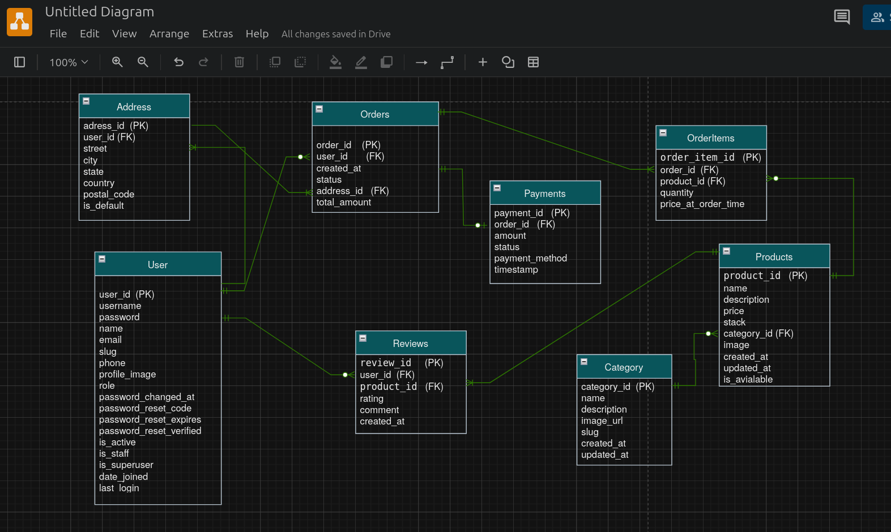

# Django Multi-Vendor E-commerce API

## 📖 Table of Contents

- [About the Project](#-about-the-project)
- [✨ Core Features](#-core-features)
- [🛠️ Technology Stack](#-technology-stack)
- [🗂️ Project Structure](#-project-structure)
- [📊 Database Schema (ERD)](#-database-schema-erd)
- [🚀 API Endpoints](#-api-endpoints)
- [🔧 Getting Started](#-getting-started)
  - [Prerequisites](#prerequisites)
  - [Installation](#installation)
- [⚙️ Environment Variables](#-environment-variables)
- [▶️ Running the Application](#️-running-the-application)

## 📝 About the Project

This project is a full-featured, multi-vendor e-commerce RESTful API built with Django and Django REST Framework. It provides a robust backend system that allows registered users to become sellers, manage their products (which require admin approval), while buyers can browse products, manage a shopping cart, place orders, and provide reviews.

The architecture is designed to be scalable, secure, and maintainable, following best practices for modern web API development.

---

## ✨ Core Features

- **User Management & Authentication:** Secure user registration and login using JWT (JSON Web Tokens).
- **Multi-Vendor System:** Users can register as sellers and manage their own product listings.
- **Product Management:** Complete CRUD operations for products, including image uploads.
- **Admin Approval System:** Products submitted by sellers must be approved by an admin before they become visible to buyers.
- **Category & Filtering:** Products are organized by categories, with advanced filtering options (by category, price range, availability).
- **Shopping Cart:** Persistent shopping cart for each authenticated user.
- **Order Management:** A complete system for placing and tracking orders.
- **Reviews & Ratings:** Users can leave reviews and ratings for products they have purchased.
- **Search Functionality:** Flexible product search by name or category.
- **Pagination:** Efficiently handles large datasets for product listings and search results.

---

## 🛠️ Technology Stack

- **Backend:** Python 3.12
- **Framework:** Django
- **API:** Django REST Framework (DRF)
- **Authentication:** Simple JWT (JSON Web Token) for stateless authentication.
- **Database:** PostgreSQL / SQLite 3 (Configurable)

---

## 🗂️ Project Structure

The project is organized into modular Django apps for better separation of concerns:

- `ecommerce_api/`: Main project configuration directory.
- `users/`: Handles user registration, authentication, and profiles.
- `products/`: Manages product details, listings, and seller associations.
- `categories/`: Manages product categories.
- `orders/`: Handles order creation, status tracking, and order items.
- `payments/`: (Future implementation) Will handle payment processing integrations.
- `reviews/`: Manages user reviews and ratings for products.
- `media/`: Stores user-uploaded files like product images.

---

## 📊 Database Schema (ERD)

The database is designed to support the complex relationships in an e-commerce platform. The key entities include Users, Products, Categories, Orders, OrderItems, and Reviews.



---

## 🚀 API Endpoints

Here is a summary of the available API endpoints. All endpoints are prefixed with `/api/`.

| Method             | Endpoint                          | Description                                 | Auth Required |
| :----------------- | :-------------------------------- | :------------------------------------------ | :------------ |
| **Authentication** |                                   |                                             |               |
| `POST`             | `/users/register/`                | Register a new user.                        | No            |
| `POST`             | `/users/login/`                   | Obtain JWT access and refresh tokens.       | No            |
| `POST`             | `/users/token/refresh/`           | Refresh an expired access token.            | No            |
| **Users**          |                                   |                                             |               |
| `GET`              | `/users/profile/`                 | Get the authenticated user's profile.       | Yes           |
| `PUT`              | `/users/profile/`                 | Update the authenticated user's profile.    | Yes           |
| **Products**       |                                   |                                             |               |
| `GET`              | `/products/`                      | Get a list of all approved products.        | No            |
| `GET`              | `/products/{id}/`                 | Get details of a specific product.          | No            |
| `POST`             | `/products/`                      | Create a new product (as a seller).         | Yes (Seller)  |
| `PUT`              | `/products/{id}/`                 | Update a product owned by the seller.       | Yes (Seller)  |
| `DELETE`           | `/products/{id}/`                 | Delete a product owned by the seller.       | Yes (Seller)  |
| **Admin**          |                                   |                                             |               |
| `GET`              | `/products/pending/`              | Get all products pending approval.          | Yes (Admin)   |
| `PATCH`            | `/products/{id}/approve/`         | Approve a pending product.                  | Yes (Admin)   |
| **Categories**     |                                   |                                             |               |
| `GET`              | `/categories/`                    | Get a list of all categories.               | No            |
| `POST`             | `/categories/`                    | Create a new category.                      | Yes (Admin)   |
| **Cart**           |                                   |                                             |               |
| `GET`              | `/cart/`                          | View the contents of the shopping cart.     | Yes           |
| `POST`             | `/cart/add/`                      | Add a product to the cart.                  | Yes           |
| `PUT`              | `/cart/update/{item_id}/`         | Update the quantity of an item in the cart. | Yes           |
| `DELETE`           | `/cart/remove/{item_id}/`         | Remove an item from the cart.               | Yes           |
| **Orders**         |                                   |                                             |               |
| `GET`              | `/orders/`                        | Get a list of the user's past orders.       | Yes           |
| `POST`             | `/orders/`                        | Create a new order from the cart.           | Yes           |
| **Reviews**        |                                   |                                             |               |
| `GET`              | `/products/{product_id}/reviews/` | Get reviews for a specific product.         | No            |
| `POST`             | `/products/{product_id}/reviews/` | Add a review to a product.                  | Yes           |

---

## 🔧 Getting Started

Follow these instructions to get a copy of the project up and running on your local machine for development and testing purposes.

### Prerequisites

- Python (3.10 or higher)
- pip (Python package installer)
- Git

### Installation

1.  **Clone the repository:**

    ```bash
    git clone [https://github.com/your-username/your-repo-name.git](https://github.com/your-username/your-repo-name.git)
    cd your-repo-name
    ```

2.  **Create and activate a virtual environment:**

    ```bash
    # For Linux/macOS
    python3 -m venv venv
    source venv/bin/activate

    # For Windows
    python -m venv venv
    .\venv\Scripts\activate
    ```

3.  **Install the required dependencies:**

    ```bash
    pip install -r requirements.txt
    ```

4.  **Set up environment variables:**
    Create a `.env` file in the root directory by copying the example file:

    ```bash
    cp .env.example .env
    ```

    Then, open the `.env` file and fill in your configuration details. See the [Environment Variables](#-environment-variables) section below.

5.  **Apply database migrations:**

    ```bash
    python manage.py migrate
    ```

6.  **Create a superuser to access the admin panel:**
    ```bash
    python manage.py createsuperuser
    ```

---

## ⚙️ Environment Variables

To run this project, you will need to add the following environment variables to your `.env` file:

```ini
# .env.example

# Django Settings
SECRET_KEY='your-secret-key'
DEBUG=True

# Database Settings (Example for PostgreSQL)
DB_ENGINE=django.db.backends.postgresql
DB_NAME=your_db_name
DB_USER=your_db_user
DB_PASSWORD=your_db_password
DB_HOST=localhost
DB_PORT=5432
```
